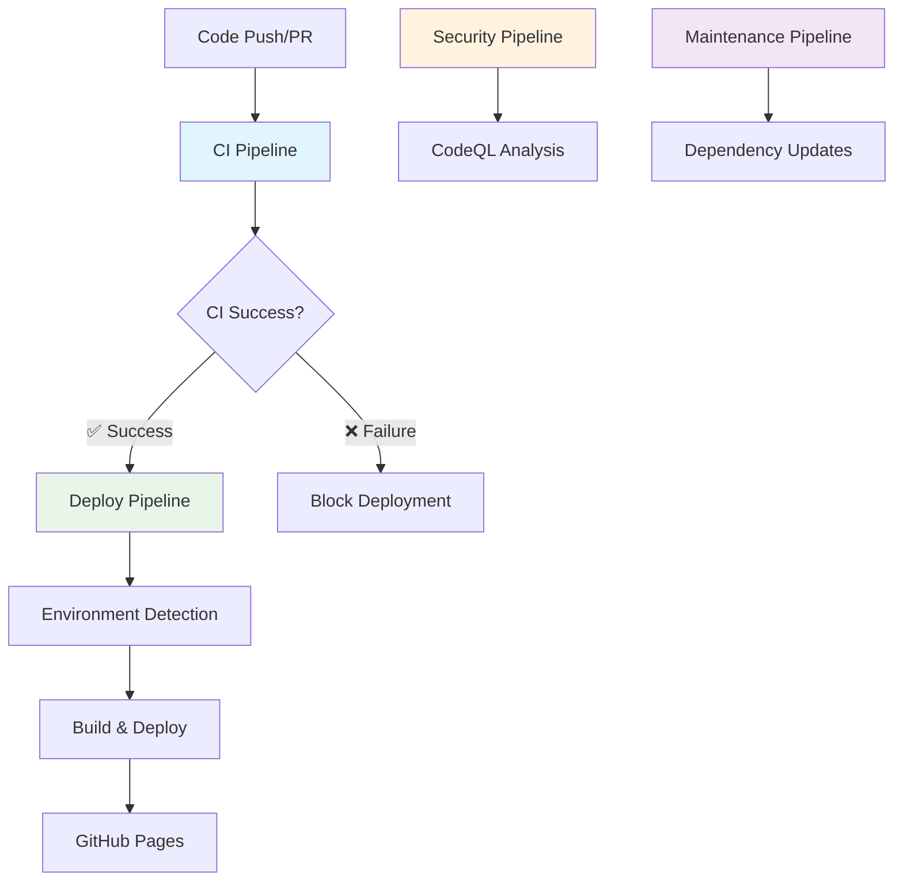

# CI/CD Architecture Documentation

## Overview

CI/CD architecture with clear separation of concerns across four specialized pipelines.

## Architecture Diagram



## Pipeline Responsibilities

### 🔍 CI Pipeline (`ci.yml`)
**Purpose:** Complete validation and quality assurance

**Triggers:**
- Push to: `main`, `dev`, `staging`
- Pull requests to: `main`, `dev`
- Manual dispatch

**Responsibilities:**
- ✅ Code quality gates (ESLint, Prettier, TypeScript)
- ✅ Complete test suite (Unit + Integration + E2E)
- ✅ Security audit
- ✅ Build verification
- ✅ Coverage analysis

**Jobs Architecture:**
```
Setup & Cache → Lint/TypeScript/Format → Unit Tests
                                      → Integration Tests
                                      → E2E Tests
                                      → Security Audit
                                      → Build
                                      → Quality Gate ✅
```

### 🚀 Deploy Pipeline (`deploy.yml`)
**Purpose:** Deployment only, triggered by successful CI

**Triggers:**
- **workflow_run**: Only after CI pipeline succeeds
- Manual dispatch with environment selection

**Security Gates:**
1. **CI Success Verification** - Explicitly checks CI status
2. **Environment Detection** - Determines target environment
3. **Dependency Chain** - Cannot run without CI success

**Responsibilities:**
- 🔒 Verify CI pipeline passed
- 🎯 Detect environment (main/staging)
- 🏗️ Build for target environment
- 🚀 Deploy to GitHub Pages

### 🔍 Security Pipeline (`codeql.yml`)
**Purpose:** Independent security analysis for compliance

**Triggers:**
- Push to `main` (production security)
- Pull requests to `main`
- Weekly scheduled scans (Mondays 6 AM UTC)
- Manual dispatch

**Responsibilities:**
- 🛡️ CodeQL security analysis
- 📊 Vulnerability reporting
- 🔍 Compliance scanning

### 🔧 Maintenance Pipeline (`auto-update.yml`)
**Purpose:** Automated maintenance and updates

**Triggers:**
- Weekly schedule (Mondays 2 AM UTC)
- Manual dispatch

**Responsibilities:**
- 📦 Dependency updates
- 🧹 Automated housekeeping
- 🔄 Pull request creation for updates

## Technical Architecture

### Pipeline Dependencies
- Deploy pipeline triggers only after CI pipeline success
- Security pipeline runs independently for compliance
- Maintenance pipeline operates on scheduled intervals
- Each pipeline has single responsibility

## Environment Configuration

### Development Environment
- **Branch:** `dev`
- **Triggers:** CI pipeline only
- **Purpose:** Feature development and testing

### Staging Environment
- **Branch:** `staging`
- **Base Path:** `/staging/`
- **URL:** `https://username.github.io/repository/staging/`
- **Purpose:** Pre-production testing

### Production Environment
- **Branch:** `main`
- **Base Path:** `/repository/`
- **URL:** `https://username.github.io/repository/`
- **Purpose:** Live production deployment

## Security Features

### Workflow Security
- **workflow_run** triggers prevent unauthorized deployments
- **Explicit CI verification** before any deployment
- **Environment-specific** build configurations
- **Secret management** through GitHub environments

### Branch Protection
Recommended branch protection rules:
```yaml
main:
  - Require status checks (CI Pipeline)
  - Require branches to be up to date
  - Require pull request reviews
  - Dismiss stale reviews

staging:
  - Require status checks (CI Pipeline)
  - Require branches to be up to date
```

## Monitoring and Observability

### Pipeline Status
- **CI Pipeline**: Must pass for any deployment
- **Deploy Pipeline**: Only runs after CI success
- **Security Pipeline**: Independent compliance reporting
- **Maintenance Pipeline**: Weekly automated updates

### Failure Handling
- **CI Failure**: Blocks all deployments
- **Deploy Failure**: Notifies with detailed error information
- **Security Issues**: Reported independently
- **Update Failures**: Creates issues for manual review

## Troubleshooting

### Common Issues

#### Deploy Pipeline Not Triggering
1. Check CI pipeline status - must be successful
2. Verify workflow_run trigger configuration
3. Check branch protection settings

#### CI Pipeline Failures
1. Review quality gate results
2. Check test failures in job details
3. Verify code formatting and linting

#### Security Pipeline Issues
1. Review CodeQL analysis results
2. Check security advisory notifications
3. Verify branch targeting in configuration

### Debug Commands

```bash
# Check workflow status
gh workflow list
gh workflow view "CI/CD Pipeline"
gh workflow view "Deploy to GitHub Pages"

# View recent runs
gh run list --workflow="CI/CD Pipeline"
gh run view <run-id>

# Manual trigger
gh workflow run "CI/CD Pipeline"
gh workflow run "Deploy to GitHub Pages"
```

## Best Practices

### Code Quality
- **All commits** must pass CI pipeline
- **No direct pushes** to main branch (use PRs)
- **Quality gates** are mandatory, not optional

### Deployment Safety
- **Never bypass CI** validation
- **Test in staging** before production
- **Monitor deployment** status and logs

### Security Compliance
- **Regular security scans** (weekly)
- **Immediate response** to security alerts
- **Keep dependencies updated** automatically

## Technical Implementation

### Workflow Triggers
- CI pipeline: Push/PR events to main, dev, staging branches
- Deploy pipeline: workflow_run trigger after CI completion  
- Security pipeline: Push to main, weekly schedule
- Maintenance pipeline: Weekly schedule, manual dispatch

### Job Dependencies
- Deploy jobs require CI success verification
- Quality gates block deployment on failure
- Environment detection based on branch context

## References

- [GitHub Actions Best Practices](https://docs.github.com/en/actions/learn-github-actions/security-hardening-for-github-actions)
- [Workflow Security](https://docs.github.com/en/actions/security-guides/security-hardening-for-github-actions)
- [Enterprise CI/CD Patterns](https://docs.github.com/en/actions/deployment/about-deployments)